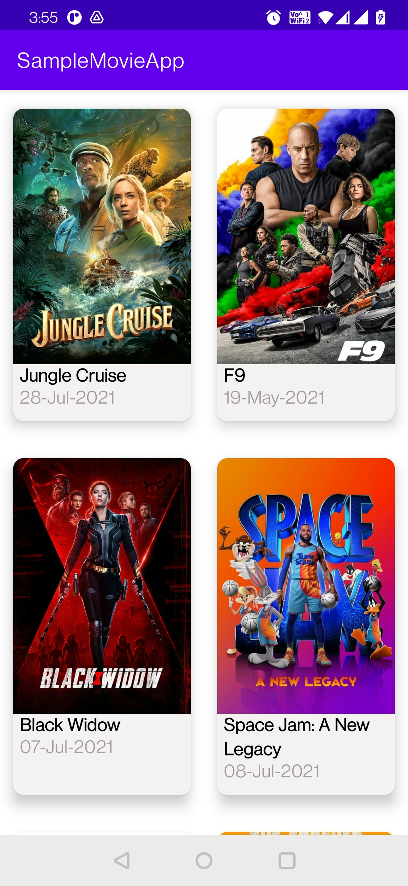
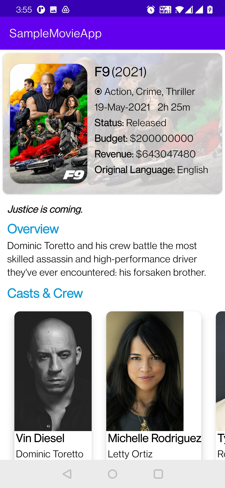
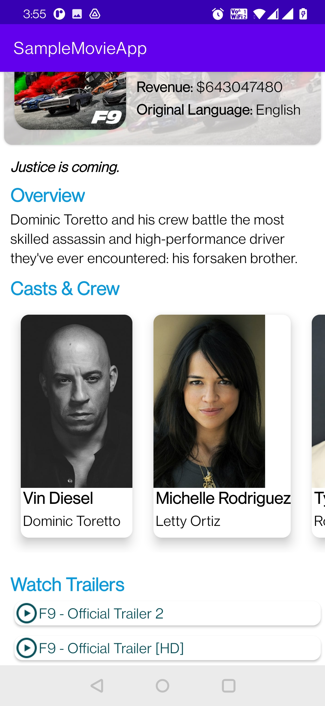
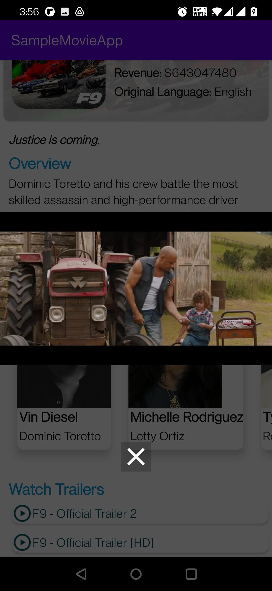
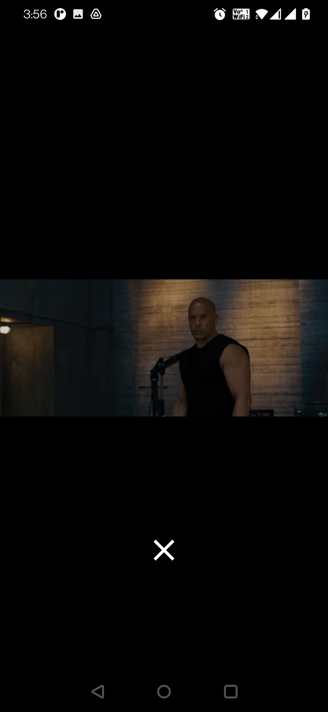

Movie App in Kotlin with Retrofit, MVVM.

# MovieApp
Sample Movie App using ThemovieDB database

Register your app on theMovieDB and get the API KEY to use for authentication in retrofit.  
To Register on theMovieDB visit: https://www.themoviedb.org/

Details API documentation is available at https://developers.themoviedb.org/3/getting-started/introduction

Few Screeshots of the App are as below:

     &nbsp;&nbsp;&nbsp;  
    

     

     &nbsp;&nbsp;&nbsp;   
     

      

     

